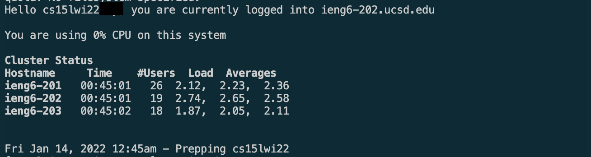

# Lab Report 1 - Logging Into A Course Specific Account

## Part 1 - Installing Visual Studio Code

When going about installing Visual Studio Code (VSC), the simplest manner is to download the installer found [here](https://code.visualstudio.com/) and follow the on-screen instructions. For most, the version suggested by the Visual Studio Code website will be the appropiate version. In cases such as mine, where the version suggested is not the most optimal or appropiate for your system, other versions of Visual Studio Code that best match your working environment/setup can be found [here](https://code.visualstudio.com/#alt-downloads). In my case, I ended up downloading the Mac Apple Sillicon version for the most optimized experience given my working environment.


//SHOW PIC OF VS CODE

## Part 2A - Setting up your course-specific accont for remote connection.

If this is your first time utilizing your course-specific account, you must first look up your account and then activate it. The account look up tool can be found [here](https://sdacs.ucsd.edu/~icc/index.php). Once on the page, input your UC San Diego username and Student ID in the first two fields respectively. Once in, you will be shown a menu showing all available course specific accounts.

 Click on the respective course account you are trying to activate. This will open a page that displays your course-specific account username alongside a prompt to reset your password in a yellow box if your account has not been activated. To activate your account, simply follow the steps in the prompt.


## PART 2B - REMOTELY CONNECTING TO STUDENT ACCOUNT

Prior to remotely connecting to your student account, if you are using a Microsoft Windows based workstation, you must install [OpenSSH](https://docs.microsoft.com/en-us/windows-server/administration/openssh/openssh_install_firstuse) to enable to remote connection. This step is not necessary for Mac or Linux users. Once VSCode is installed, you may open it through the Terminal Tab at the top of the screen and choosing New Terminal. More options for opening the terminal can be found [here.](https://code.visualstudio.com/docs/editor/integrated-terminal)

Once the terminal is open, you can connecect remotely to your CSE course specific account by running the following command, where X is your student username fromthe previous account.

```
$ ssh x@ieng6.ucsd.edu
```

For example:
```
$ ssh cs15lwi22@ieng6.ucsd.edu
```

A prompt will then appear, claiming that the authenticity of the host cannot be found. Type yes to proceed. You will then be prompted for the password you set for the account in Step 2A. Enter the password set to continue. Once you are succesfully connected, you will a see a terminal similar to this one. 


Congratulations, you have connected to a remote location succesfully! 

## PART 3 - TRYING SOME COMMANDS

Once connected to the remote server, you can now run commands on the server. Try some of the following commands to get acquainted with the terminal

```
ls > Lists files within the current directory

pwd > Prints the path to your current working directory

whoami > Returns information regarding your current log in session.

ls -lat > Returns a detailed breakdown for files within the current directory. 

exit > Logs you out of the remote server
```


## PART 4 - Moving Files with scp

One of the most noticable features of having a remote server to be able to connect to is to be able to host files on that remote server and execute/run those files. We can also move files from our local machine to a remote server. 

For example, we can create a java file, copy it to our remote server, then run the file. To test this out, create the following java file and name is `WhereAmI.java`.

```
class WhereAmI {
  public static void main(String[] args) {
    System.out.println(System.getProperty("os.name"));
    System.out.println(System.getProperty("user.name"));
    System.out.println(System.getProperty("user.home"));
    System.out.println(System.getProperty("user.dir"));
  }
}
```

Once the file has been created, open a terminal and open the directory in which the `WhereAmI.java` is located by using the cd command. For example, the following command opens the directory in which my `WhereAmI.java` file is located.
```
cd /Users/apollolarragoitia/Desktop/WINTER2022UCSD/cs15l
```
You can then running the following command, where X is your course-specific account username.
```
scp WhereAmI.java X@ieng6.ucsd.edu:~/
```

The two commands executed have copied a file from the local directory to the remote directory. To test if this was succesful, you may connect to your course-specific account through ssh. Once logged in, run the command `ls`. It should display a variety of files, one of which being `WhereAmI.java`. It should return a similar outcome to this.

.

If the `WhereAm.java` is present within the remote directory and you are still logged in, you may then compile and run it by using the `java` and `javac` commands.

## PART 5 - SETTING AN SSH KEY

SSH keys allow us to create a set of keys, a public key and a private key. These keys allow us to remotely connect to a server, in this case our course-specific account, without having to provide a password everytime one attempts to log in. This is done by the server comparing the public key it has in comparrison to your private key, that only you have. 

Generate a pair of SSH keys by opening a terminal on your local machine and running the command `ssh-keygen`. Follow the prompts on screen. You will recieve a prompt similar to this one. 

 If on Windows, an additional step of `ssh-add` is necessary. The documentation for this can found [here.](https://docs.microsoft.com/en-us/windows-server/administration/openssh/openssh_keymanagement#user-key-generation)

Once both keys are created, you may then copy the public key to your course-specific account by utilizing the follow commands, where X is your course-specific account.


```
# this first step logs into your course-specific account.

$ ssh x@ieng6.ucsd.edu

# this command creates a directory that the SSH-Keys will saved.

$ mkdir .ssh

# logs you out of your course-specfic account and opens the terminal on your client.

$ exit

# copys the public ssh key to course-specific server

$ scp /Users/x/.ssh/id_rsa.pub cs15lwi22@ieng6.ucsd.edu:~/.ssh/authorized_keys 
```
Once the public SSH Key has been copied to the server, you are now able to connect to the server through SSH without having to input a password each time.

## PART 6 - OPTIMIZING REMOTE RUNNING

There are a variety of methods to be able to optimize remote running. One of method is to execute multiple commands in the same line in order to minmize reduntive commands or typing. For example the following command compiles the `WhereAmI.java` on the local machine, run it, then copys it to the remote server where it compiles and runs it. 
```
javac WhereAmI.java; java WhereAmI; scp WhereAmI.java cs15lwi22aay@ieng6.ucsd.edu:~/ ; ssh cs15lwi22aay@ieng6.ucsd.edu "javac WhereAmI.java; java WhereAmI"
```

OUTPUT


In this command, the first javac and java were executed on the local machine in a terminal open in the directory it was located in. These two commands were divided by a semi-colon, `";"`, which allowed for running the multiple commands on the same line. The command `scp WhereAmI.java` copys the java file onto the remote server. `ssh cs15lwi22aay@ieng6.ucsd.edu "javac WhereAmI.java; java WhereAmI"` connects to the remote server and then runs javac and java on that remote server.

## References
1. https://ucsd-cse15l-w22.github.io/week/week1/
2. https://code.visualstudio.com/docs/editor/integrated-terminal


