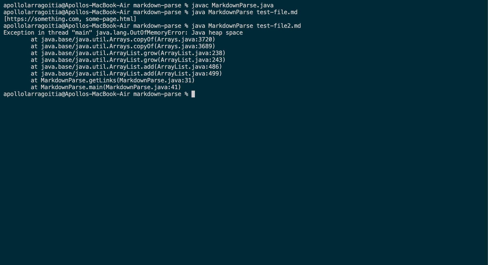
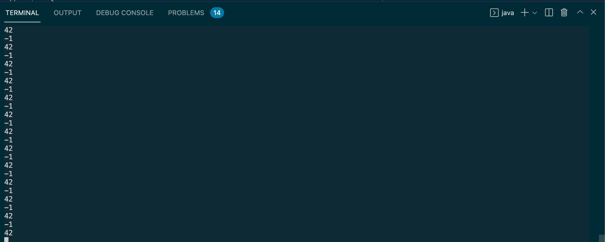
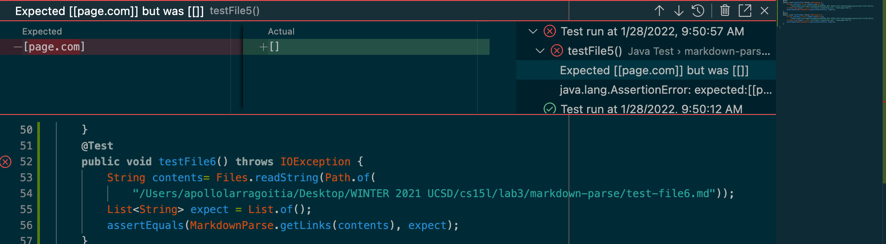

# Lab Report 2 - When Test acccumulate

## Part  0  - Preface

Given the circusmtances of what happened, I feel it best to include a preface to elaborate on the situation of the work surronding the lab. My lab group--alongside countless others had run into issues while running the code, particutlarly running the code on Windows machies. I also ran into some issues with using jUnit while compiling. As such, my history of changes and methods will differ from my groupmates given that there was a lot more indpendent work done.

## PART 1 - Symptom Zero
The first of the symptoms I ran into whiel working on this lab was one unrelated to the code itself, but instead to the working environment itself. When initally attemping to run the code as is when cloned from GitHub, I was unable too. This was due to the fact the Java JDK I was working with was Java 8, while one of the functions used was from Java 11. This resulted in a `java.lang.Error: Unresolved compilation problem:` when attemping to test file one.

As mentioned, this was an error on the part of working environment. To fix this, I had to reinstall Java JDK.

## PART 2 - Symptom 1

[GitHub Commit for Symptom 1](https://github.com/apollolarragoitia/markdown-parse/commit/3b7cc3d1d94202c2629f0c0ae797252b79760dbf)

Input: test-file2.md
Expected Output: [https://something.com, some-page.html]

Actual Output: Looping

Suspected Reason: Current Index is somehow being manipulated in a way that it will at some point in the while loop, decrease. If it decreases, then the loop will never end as it will never meet the conditions for ending the loop.

## PART 2.1 - Symptom 1 Solution
[GitHub Commit for Symptom 1 Solution](https://github.com/apollolarragoitia/markdown-parse/commit/9f3b3e35ec228dc3af65ef4d3c943ba6568385fb)

Symptom 1 was initially caused by a faulty image link if statement to check if the following link was for an image or for a url. What happened originally was that the statement would not update the index correctly, causing the index to decrease, reseting the loop and causing an infinite loop where index would never reach the end of the while condition. With the current code, two conditions must be met, which is that the index of openBracket is greater than 0 and that the char at the index openBracket -1 is equal to exclamation point. In this scenario, the method will skip that link and go to the next one, updating the currentIndex accordingly.

## PART 3 - Symptom 2

[GitHub Commit for Symptom 2](https://github.com/apollolarragoitia/markdown-parse/commit/b74f6361f889da251192244ba4f5d21076438f0e)

Input: test-file2.md
Expected Output: [https://something.com, some-page.html]

Actual Output: Looping between -1 and 42. Symptom 1 looped between multiple indexs for open brackets.

Suspected Reason: I believe that this is due to a lack of a statement to catch what happens when markdown.indexOf does not return a non-negative index. This causes it too loop as it sets the index to -1. 

## PART 3.1 - Symptom 2 Solution

[GitHub Commit for Symptom 2 Solution](https://github.com/apollolarragoitia/markdown-parse/commit/ed3a11b914cc02dd519b83c926b13deea1259344)

For the moment, Ive temporarily removed the checker for images that I believed was causing Symptom 1. I created checks that break the while loop if any of the indexes of both parenthesis index and brackets index returned a negative value. I know that if they returned a negative value, it signified they had reached the end of the list and were unable to go any further. Without the if statement to check. If this negative value were passed through or not handled, it was cause currentIndex to become equal to negative one once closeParenthesis reached the end, causing it to loop.

## PART 4 - Symptom 3

Input: test-file5.md
Expected Output: []

Actual Output: [page.com]

Suspected Reason: I believe that this error is caused due to there not being a check if the data within parenthesis are valid links in markdown format. That is to say, the current code interprets anything in parenthesis, whether it is in a valid position adjacent to a bracket pair or in an invalid position not adjacent to a bracket pair.

## PART 4.1 - Symptom 3 Solution

My hunch was right and it seems that a lack of a check for the brackets and parenthesis being adjacent to one another was the culprit. I've added an if statement that checks if the char to the right of the closeBracket is an open parenthesis. If it is, that means the following parenthesis pair is valid and the link is added. If not, then the parenthesis pair are not a valid link given it is not adjacent to a brackets pair and is not added.