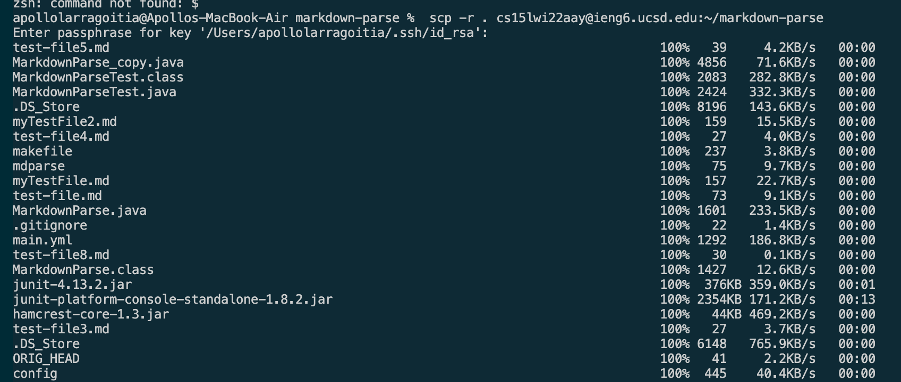

# Lab Report 3 - Copying Whole Directories with SCP -R

## Step 1 - Copying markdown-parse To ieng6

In order to copy the markdown-parse directory into ieng6, the directory must first be accessed in terminal. This can be done by using cd, and verified using pwd and ls to verify both the path and contents of the directory. Once the current directory is verified, we can copy the entirty of the markdown-parse directory into an ieng6 account using the following command.

`$ scp -r . cs15lwi22aay@ieng6.ucsd.edu:~/markdown-parse`

This tells the terminal to recurssively copy the current directory, which is markdown-parse into the directory markdown-parse on the server `cs15lwi22aay@ieng6.ucsd.edu.` If the directory of markdown-parse does not exist on the server, it will create the directory and the local directory into th remote directory. The name of the directory on the server is indepdent of the directory being copied, meaning we can change the name of the directory on the remote server to be anything.

Upon executing the command to copy the directory, the terminal will print the following, showing the status of
the files being copied.

Once the files are done copying, we can verify this by accessing the ieng6 account and inspecting the directory of markdown-parse. This can be done by doing the following command `ssh cs15lwi22aay@ieng6.ucsd.edu "ls markdown-parse"`. This connects to the ieng6 server and then list the contents of directory markdown-parse.
.

## Step 2 - Compiling and Running markdown-parse

Once the directory of markdown-parse is on the ieng6 server, the contents of the directory can be compiled by connecting to the ieng6 server through `ssh cs15lwi22aay@ieng6.ucsd.edu`, accessing the markdown-parse directory with `cd markdown-parse` and compiling and executing MarkdownParse.java and MarkdownParseTest.java.

Accessing the markdown-parse directory.

This is done by using `javac MarkdownParse.java` to compile the MarkdownParse.java file. Since then MarkdownParseTest.java uses the jUnit library, the following command must be executed to first compile it: 
`javac -cp .:lib/junit-4.13.2.jar:lib/hamcrest-core-1.3.jar MarkdownParseTest.java`
and then run int using 
`java -cp .:lib/junit-4.13.2.jar:lib/hamcrest-core-1.3.jar org.junit.runner.JUnitCore MarkdownParseTest`

Compiling and executing the MarkdownParseTest.

## Step 3 - Optimizing Running 

The methods shown so far are effective, but are there more efficent manners of going about it. You could copy the directory, accessing the directory in the server and compile it with one command. The following command copys the directory of markdown-parse to the ieng6 server and execute MarkDownParseTest.

`ssh cs15lwi22aay@ieng6.ucsd.edu "mkdir markdown-parse"; scp -r *.java *.md lib/ cs15lwi22aay@ieng6.ucsd.edu:markdown-parse; ssh cs15lwi22aay@ieng6.ucsd.edu "cd markdown-parse; /software/CSE/oracle-java-se-14/jdk-14.0.2/bin/javac MarkdownParse.java; /software/CSE/oracle-java-se-14/jdk-14.0.2/bin/javac -cp .:lib/junit-4.13.2.jar:lib/hamcrest-core-1.3.jar MarkdownParseTest.java; /software/CSE/oracle-java-se-14/jdk-14.0.2/bin/java -cp .:lib/junit-4.13.2.jar:lib/hamcrest-core-1.3.jar org.junit.runner.JUnitCore MarkdownParseTest"`

The first line ` ssh cs15lwi22aay@ieng6.ucsd.edu "mkdir markdown-parse"` creates the directory of markdown-parse in ieng6 server if the directory does not already exist. The line `scp -r *.java *.md lib/ cs15lwi22aay@ieng6.ucsd.edu:~/markdown-parse` copies only the java source code, the .md files used in testing, and everything located in the lib folder. The line ` ssh cs15lwi22aay@ieng6.ucsd.edu "cd markdown-parse;` connects to the remote directory and changes the directory to the markdown-parse folder. The line `javac MarkdownParse.java;` compiles the source code of MarkdownParse.java. The line `javac -cp .:lib/junit-4.13.2.jar:lib/hamcrest-core-1.3.jar MarkdownParseTest.java; java -cp .:lib/junit-4.13.2.jar:lib/hamcrest-core-1.3.jar org.junit.runner.JUnitCore MarkdownParseTest"` compiles MarkdownParseTest.java and runs it.

## Sources
1. https://ucsd-cse15l-w22.github.io/week/week5/#group-choice-3-copy-whole-directories-with-scp--r
2. https://ucsd-cse15l-w22.github.io/week/week6/

