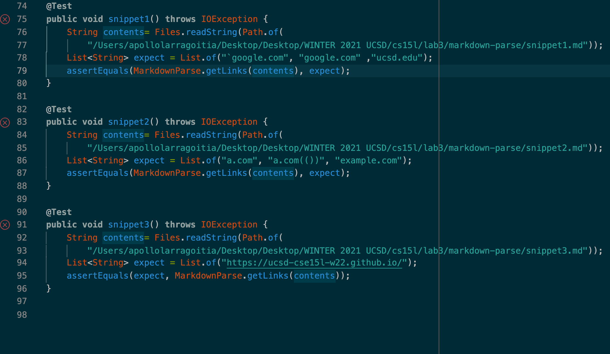

# Lab Report 4

## Step 1 - Snippets and Expected Outputs

The following snippets are given as test inputs for the MarkdownParse.java project.

[Our Markdown](https://github.com/apollolarragoitia/markdown-parse)
[Reviewed Markdown](https://github.com/Obarquinho/markdown-parse)
    
It was ran with the following Junit Tests:




Snippet 1 Input:
```
`[a link`](url.com)

[another link](`google.com)`

[`cod[e`](google.com)

[`code]`](ucsd.edu)
```

Snippet 1 Expected MarkdownParse Output : ``google.com,google.com,ucsd.edu`

Snippet 2 Input:
```
[a [nested link](a.com)](b.com)

[a nested parenthesized url](a.com(()))

[some escaped \[ brackets \]](example.com)
```

Snippet 2 Expected MarkdowParse Output: `a.com,a.com(()), example.com`

Snippet 3 Input: 
```
[this title text is really long and takes up more than 
one line

and has some line breaks](
    https://www.twitter.com
)

[this title text is really long and takes up more than 
one line](
    https://ucsd-cse15l-w22.github.io/
)


[this link doesn't have a closing parenthesis](github.com

And there's still some more text after that.

[this link doesn't have a closing parenthesis for a while](https://cse.ucsd.edu/


)

And then there's more text
```

Snippet 3 MarkdownParse expected output: `https://ucsd-cse15l-w22.github.io/`

# Step 2 - Outputs given different implementations.

Step 2.1 - Outputs using our implementation

Snippet 1


Snippet 2


Snippet 3


Step 2.2 - Outputs using reviewed implementation


# Step 3 - Possible Changes to Address Errors

I had ran into errors for all of my test cases. However, it seems that errors for most of them appear to be addresable.

For the first issue, it appears that there to be an error in incorrectly parseing links where the header has inline code syntax.I do not believe a simple code change code be used to address this issue. This is due to the fact that there are a variety of cases where the usage of inline code syntax still results in an valid output. Take for example, in snippet 1, where inline code syntax is used in the url of google.com. Despite it being surrondeded by "`" to signify to that it is a piece of incline code, it appears that the backtick within the url is not recognized when it comes to the implementation of line block code.

Furthermore, the second example of google has the following syntax which results in a valid link to be parsed. It appears that it has to do with both the backtick being located within the text box of the URL, yet when attemping to surrond it by a normal single line code block, it results in an invalid link.There are just to many incosistencies and a lack of Markdown knowledge on this level to implement a catch-all fix for backticks.
```
[`cod[e`](google.com)
```
For the issue with the second snippet, it also appears that a simple code solution would not be possible. In this scenario, my code did not properly parse the following link.
```
[some escaped \[ brackets \]](example.com)
```

This is due to the fact that my implementation is currently reliant of comparing the first found instance of a bracket pair to the first found instance of a parenthesis pair.

In this case, the first found bracket pair are highlight in back ticks, alongside the first found parenthesis pair. As you can see, the first pair combination parsed are the brackets are not directly adjacent to the parenthesis pair. My implementation checks that the index of the open parenthesis is equal to the index of the closed bracket found plus one to ensure only valid syntax is parsed. However, in this, the usage of nested brackets results in comparing the wrong bracket pair to the parenthesis pair containing the URL. To implement this code change, I would need to come up with a set of methods that is able to parse through nested brackets. For example, I could have it check the characters present within the index range of the first found close bracket to the second found open bracket, checking for any nested brackets or open brackets that may render it an invalud close bracket/open bracket pair. While this solution could work for this problem, it would not be a dynamic solution to solving the issue of parseing links with multiple nested brackets present. 

```
`[` some escaped \[ brackets \`]`]`(`example.com`)`
```

With the final issue present in snippet 3, I believe that this issue cannot be solved without changing the manner in which data is passed through. Currently, my implementation is passing through the .md files as an extremely long String. However, in doing so, I end up losing information regarding the line count, line breaks, or any line breaks seperating code. An implementation that I could use would to instead use a Scanner to go through the file line by line using a while hasNext() loop. If a blank line is found and the , then all variables could be set to 0, signifying that a line break occured and overloading the integer 0 to represent such a scenario. However, it would also result in having to come up with a new manner of parseing valid links that take more then one line such as.

```
[this title text is really long and takes up more than 
one line](
    https://ucsd-cse15l-w22.github.io/
)
```

Something I think that could work would be to use a Scanner to find the index where line breaks occur, then parse through the file as a String as I normally would, however when passing through the index at which line breaks were found, the variables such as closed parentheis, open parenthesis, and closed bracket get bet set to -2 to signify that an line break occured which esesentially isolated the previous Markdown text from the next.


