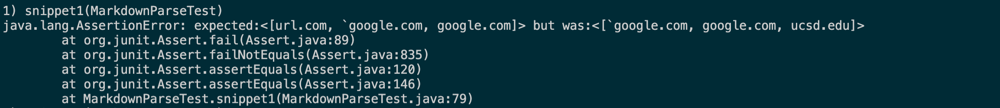
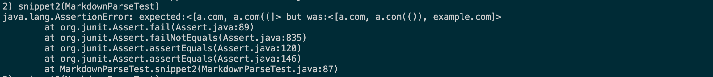
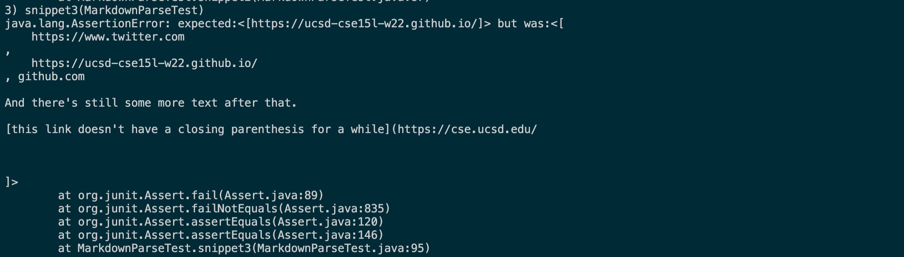
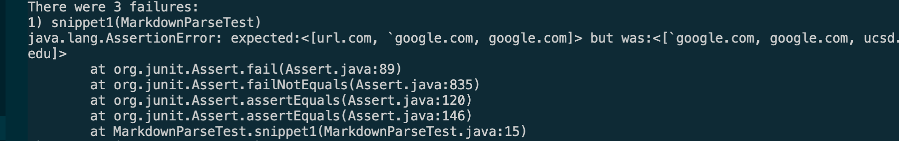
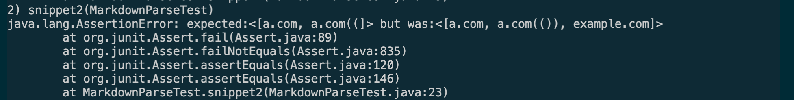

# Lab Report 3 - Copying Whole Directories with SCP -R

## Step 1 - Snippets and Expected Outputs

The following snippets are given as test inputs for the MarkdownParse.java project.

Snippet 1 Input:
```
`[a link`](url.com)

[another link](`google.com)`

[`cod[e`](google.com)

[`code]`](ucsd.edu)
```

Snippet 1 Expected MarkdownParse Output : ``google.com,google.com,ucsd.edu`

Snippet 2 Input:
```
[a [nested link](a.com)](b.com)

[a nested parenthesized url](a.com(()))

[some escaped \[ brackets \]](example.com)
```

Snippet 2 Expected MarkdowParse Output: `a.com,a.com(()), example.com`

Snippet 3 Input: 
```
[this title text is really long and takes up more than 
one line

and has some line breaks](
    https://www.twitter.com
)

[this title text is really long and takes up more than 
one line](
    https://ucsd-cse15l-w22.github.io/
)


[this link doesn't have a closing parenthesis](github.com

And there's still some more text after that.

[this link doesn't have a closing parenthesis for a while](https://cse.ucsd.edu/


)

And then there's more text
```

Snippet 3 MarkdownParse expected output: `https://ucsd-cse15l-w22.github.io/`

# Step 2 - Outputs given different implementations.

Step 2.1 - Outputs using our implementation

Snippet 1


Snippet 2


Snippet 3



Step 2.2 - Outputs using reviewed implementation






# Step 3 - Possible Changes to Address Errors


