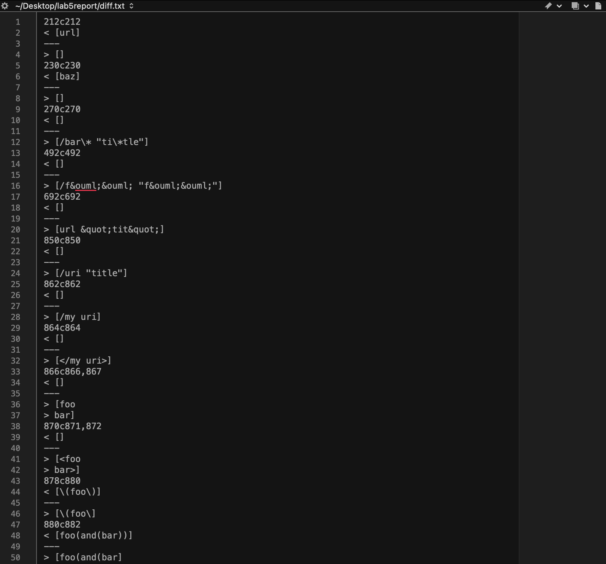
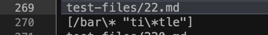
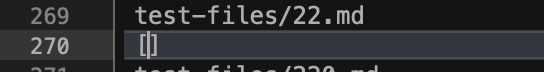
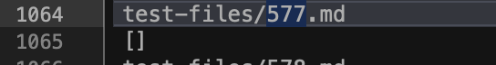
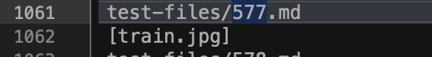

# Lab Report 5 - Common Mark Spec Test Comparrison

## Step 1 - Finding differences between implementations.
Firstly, in order to recognize any differences between my implemention and the 
implementation provided, I ran the following bash script, bash.sh.

```
for file in test-files/*.md;
do
    echo $file
    java MarkdownParse $file
done
```

The following parameters were also added onto the bashscript.
`bash script.sh > [repoNameHere].txt`

Once a the output of the bash script are made, they are compared using the following unix method
`diff MyMarkdownParse.txt ProvidedImplementation.txt > diff.txt`




In comparing using the diff unix method, I am able to determine different ouputs of the different implementations. Using this method, I found that the output for my implementation and the
provided implementation were quite similar. However, there were some cases that stuck out in which the provided implementation differed from mine. 


## Step 2 - Test Case 22.md

For this test case, my implementation returned nothing. 




While the provided implementation returned the following.



For this case, I believe my implementation is incorrect as it is returning the invalid link of 
`[/bar\* "ti\*tle"]`, when it should simply return `[]` since `[/bar\* "ti\*tle"]` is not a valid link.

I believe this is due to the fact that implementation has a lack of an extensive built in check when parsing texts as links. While I do have checks in place for some illegal or invalid characters, I do not have checks present for **ALL** illegal characters. For example, it does not check if the text for a link provided contains required features of a link, such as a valid Top Level Domain Extension. To remedy this edge case, I could either include more checks for illegal characters or include a check that makes sure a Top Level Domain Extension is present within the link.

## Step 3 - Test Case 577.md
For this test case, my implementation returned nothing. 



While the provided implementation returned the following.



`[train.jpg]`

For this case, I believe my implementation properly handleded this case. Following the guidelines of MarkdownParse, the implementations should not return any links for images. However, test case 577.md contained solely image links. As such, I believe the return case for the provided implementation was correct. It appears that this case occured due to there not being a check to not return image type links. To remedy this case, a check could be included that checks if the character prior the open bracket signaling the start of an image is an exclamation mark. In such a case, nothing should be added from the following link to the return list.


